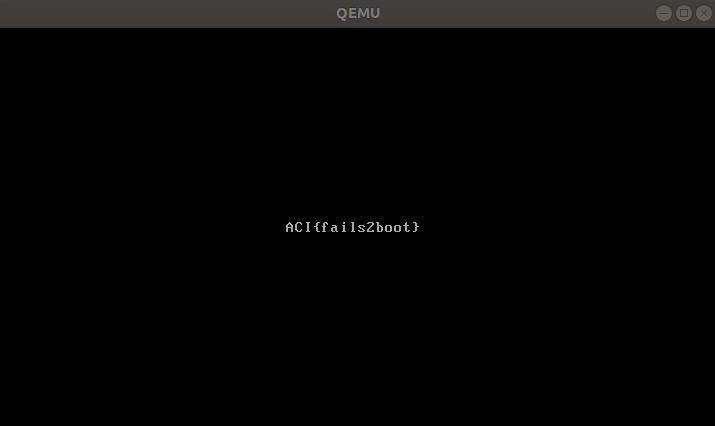

# Boot Master

## Forensics: 75 points

## Description

We found another floppy disk [files.tar.gz](./files.tar.gz), but we can't get this one to boot like we did the last one. The disk had been sitting around for a while so we're wondering if some of the data was corrupted. Any ideas?

## Hints

* It looks like `file floppy.img` identifies this one as just "data"...
* How does `file` recognize that an image contains a [master boot record](https://en.wikipedia.org/wiki/Master_boot_record)?
* You'll probably need some kind of 'hex editor' for this problem.
* Can we change one bit in the image and fix the problem?

## Solution
First untar the file:
```
$ tar -xvf files.tar.gz 
floppy.img
```

Check the image's file type:
```
$ file floppy.img
floppy.img.bak: data
```

It's just a data blob.

The hint suggests a hex editor and to change one bit. It also links to the Master Boot Record (MBR) wiki. Take a look at the wiki. There at least six different MBR formats. However, all six consists of 512 bytes total and all have the same two signature bytes: `0x55AA`. 

Open up the floppy with hexdump:
```
$ hexdump -C floppy.img
00000000  b4 0e e8 68 00 e8 41 00  e8 62 00 fa f4 bb 32 66  |...h..A..b....2f|
00000010  b9 73 61 ba 6c 69 be 6f  62 bf 6f 74 88 f8 cd 10  |.sa.li.ob.ot....|
00000020  88 e8 cd 10 88 f0 cd 10  88 d0 cd 10 88 c8 cd 10  |................|
00000030  88 d8 cd 10 89 f3 89 f9  88 f8 cd 10 88 c8 cd 10  |................|
00000040  88 d8 cd 10 88 e8 cd 10  c3 31 c9 b0 20 cd 10 41  |.........1.. ..A|
00000050  83 f9 20 7c f6 b0 41 cd  10 b0 43 cd 10 b0 49 cd  |.. |..A...C...I.|
00000060  10 b0 7b cd 10 e8 a5 ff  b0 7d cd 10 c3 31 c9 b0  |..{......}...1..|
00000070  0a cd 10 41 83 f9 0c 7c  f6 c3 00 00 00 00 00 00  |...A...|........|
00000080  00 00 00 00 00 00 00 00  00 00 00 00 00 00 00 00  |................|
*
000001f0  00 00 00 00 00 00 00 00  00 00 00 00 00 00 51 aa  |..............Q.|
00000200  00 00 00 00 00 00 00 00  00 00 00 00 00 00 00 00  |................|
*
00168000
```

Since the MBR is 512 bytes long, the last byte should be on address 511 or `0x1FF`, which is right before address `0x200`. Look at the line on `0x1F0`: 
```
000001f0  00 00 00 00 00 00 00 00  00 00 00 00 00 00 51 aa  |..............Q.|
```

The signature is `0x51AA`. This is not the correct signature. It should be `0x55AA`. Break down `0x51AA` and `0x55AA` into binary:
```
Hex      Binary
0x51aa = 0101 0001 1010 1010
0x55aa = 0101 0101 1010 1010
               ^
               this bit differs
```
These two numbers differ by only one bit, which falls in line with the hint. Fix this error and the floppy should boot. Open up the floppy in vim:
```
$ vim floppy.img
```

Enter hex mode with this command:
```
:%!xxd
```

Go to the line containing the boot signature. Change the 1 to a 5. Now exit hex mode (make sure to press **Esc** first):
```
:%!xxd -r
```

Exit vim and save:
```
:x
```

Check the file type:
```
$ file floppy.img
floppy.img: DOS/MBR boot sector
```

Now boot up the floppy:
```
$ qemu-system-i386 floppy.img
```

Get the flag:


